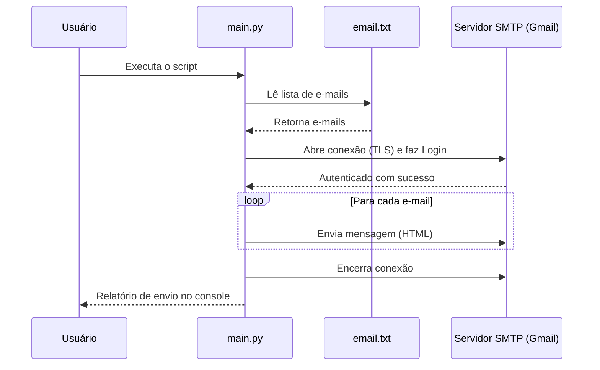

# Automação de E-mail com Gmail

## 🎯 Objetivo e Problema

**Problema:** Enviar e-mails repetitivos manualmente para uma lista de contatos consome muito tempo, é passível de erros humanos e não é escalável.

**Objetivo:** Automatizar o envio em massa de e-mails utilizando a conta do Gmail. O script lê uma lista de contatos a partir de um arquivo de texto e envia uma mensagem padronizada em formato HTML de forma iterativa, reaproveitando a mesma conexão com o servidor SMTP para evitar bloqueios e melhorar a performance.

## 🏗️ Arquitetura

O funcionamento do script é simples e direto:



## � Como Rodar

### Pré-requisitos
* Python 3.8+
* Uma conta do Google (Gmail ou Google Workspace)
* Senha de Aplicativo gerada na sua conta do Google (Autenticação em 2 fatores precisa estar ativa).

### Ambiente de Desenvolvimento (Local)

1. Clone o repositório ou baixe os arquivos.
2. Certifique-se de que o arquivo `email.txt` está na mesma pasta, com um e-mail por linha.
3. Edite o arquivo `main.py` e insira suas credenciais:
   ```python
   meu_email = "seu_email@dominio.com"
   minha_senha = "sua_senha_de_app"
   ```
4. Execute o script no terminal:
   ```bash
   python main.py
   ```

## � Exemplos de Input/Output

Como não é uma API HTTP, o "request/response" se dá pelo arquivo de texto e saída no terminal:

**Input (`email.txt`):**
```text
contato1@empresa.com
cliente2@email.com
```

**Output (Console):**
```text
Foram encontrados 2 e-mails para envio.
Email enviado com sucesso para: contato1@empresa.com
Email enviado com sucesso para: cliente2@email.com
```

## 🐳 Docker

Se preferir rodar o script em um container isolado sem se preocupar com a versão do Python instalada na sua máquina, utilize o Docker.

Crie um arquivo chamado `Dockerfile` na raiz do projeto:

```dockerfile
# Usa uma imagem oficial e leve do Python
FROM python:3.11-slim

# Define o diretório de trabalho dentro do container
WORKDIR /app

# Copia os arquivos do projeto
COPY main.py .
COPY email.txt .

# Comando padrão ao iniciar o container
CMD ["python", "main.py"]
```

Para rodar usando Docker:
```bash
docker build -t automacao-email .
docker run --rm automacao-email
```

## 🧪 Testes

Para garantir que a lógica principal não quebre (por exemplo, a extração de e-mails), você pode adicionar testes unitários usando o `pytest`.

Crie um arquivo `test_main.py`:

```python
import pytest
from unittest.mock import patch

# Cria um arquivo de texto temporário para testar a leitura corretamente
def test_leitura_arquivo_emails(tmp_path):
    d = tmp_path / "sub"
    d.mkdir()
    p = d / "email.txt"
    p.write_text(" teste1@email.com \n teste2@email.com\n\n")
    
    with open(p, "r") as arquivo:
        emails = [linha.strip() for linha in arquivo.readlines() if linha.strip()]
        
    assert len(emails) == 2
    assert emails[0] == "teste1@email.com"
    assert emails[1] == "teste2@email.com"
```

Para rodar os testes localmente:
```bash
pip install pytest
pytest test_main.py
```

## ⚙️ GitHub Actions (CI)

Podemos automatizar a checagem de qualidade do código assim que ele for "upado" no GitHub.
Crie o arquivo `.github/workflows/ci.yml` no seu repositório:

```yaml
name: Python CI

on:
  push:
    branches: [ "main" ]
  pull_request:
    branches: [ "main" ]

jobs:
  build-and-test:
    runs-on: ubuntu-latest

    steps:
    - uses: actions/checkout@v3

    - name: Set up Python
      uses: actions/setup-python@v4
      with:
        python-version: "3.11"

    - name: Install dependencies
      run: |
        python -m pip install --upgrade pip
        pip install flake8 pytest

    - name: Lint with flake8
      run: |
        # Para o build se houver erros de sintaxe ou variáveis não definidas
        flake8 . --count --select=E9,F63,F7,F82 --show-source --statistics
        # Avisos padrão
        flake8 . --count --exit-zero --max-complexity=10 --max-line-length=127 --statistics

    - name: Test with pytest
      run: |
        pytest
```

Esta pipeline irá automaticamente: rodar na nuvem do GitHub, instalar o Python, buscar erros de sintaxe (`flake8`) e rodar seus testes unitários (`pytest`) toda vez que você atualizar o código.
